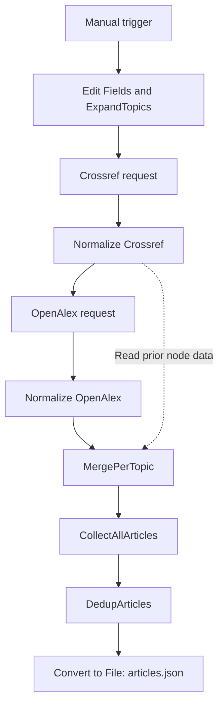

# Literature Parser for n8n

Collect research metadata from Crossref and OpenAlex, normalize records and export a deduplicated article dataset for downstream processing.

## Problem

Research topics need to become structured publication records before further automation can resolve documents or analyze metadata. This workflow makes the collection and transformation steps inspectable in n8n.

## What it does

Expands a configured topic list, requests up to 20 results per topic from each source, normalizes fields, merges records and exports `articles.json`.

## Workflow architecture

The graph follows the actual sequential connections in [parser.json](parser.json). MergePerTopic reads outputs from both normalization nodes.

## Engineering decisions

Normalization produces DOI, title, year, journal, authors, URL, source and topic fields. Deduplication lowercases and trims the DOI, falling back to title when DOI is absent. The first record's metadata and topic are kept; additional matching sources are appended.

The field named `canonical_doi` is a deduplication key, not always a DOI: it can contain a title. DOI URL prefixes are not stripped, so equivalent bare and URL-form DOIs can remain separate.

## Setup

1. Import [parser.json](parser.json) into an n8n instance.
2. Open **Edit Fields** and edit the `topics` array in its raw JSON output. Preserve `topic_id` and `topic_query`.
3. Review the **HTTP Request** (Crossref) and **OpenAlex** nodes. The exported nodes contain no credentials; configure access according to current provider requirements.
4. Run **Start Stage A** manually.
5. Inspect each normalization node, then DedupArticles.
6. Download the binary output from **Convert to File** as `articles.json`.

No n8n version is pinned. Import compatibility and live execution need checking in your instance. The final node creates a file within execution output; it does not persist it to a server directory or cloud storage.

## Input and output

The committed workflow contains nine topic records. Each has `topic_id` and `topic_query`; the first topic is T01 and concerns measure theory.

Output fields: `canonical_doi`, `doi`, `title`, `year`, `journal`, `authors`, `url`, `topic_id`, `topic_query`, `sources`. The code returns one item whose JSON contains an `articles` array; Convert to File serializes it.

A compatible recorded export is checked into [PDF Hunter's input](https://github.com/BrysinSS/pdf-hunter-python/blob/main/input/articles.json), and [its loader](https://github.com/BrysinSS/pdf-hunter-python/blob/main/src/pdf_hunter.py) explicitly accepts `[{"articles": [...]}]`. This establishes a file-based handoff. There is no automatic connection between the repositories.

For downstream DOI APIs, normalize DOI URL prefixes before use: PDF Hunter currently passes `doi` through unchanged.

## Existing workflow screenshot

The original image is included as historical visual evidence; the JSON export is the source of truth for node settings.

## Testing and limitations

No automated test suite or GitHub Actions workflow is included. For manual acceptance, verify topic counts, inspect both API responses, compare normalized records against source metadata, check duplicate DOI forms, download the result and inspect its wrapper before handing it to PDF Hunter.

- Only the first requested page is fetched; no pagination is implemented.
- API response order is paired with topics by array index.
- First-record wins can discard additional topic associations and richer metadata.
- OpenAlex journal extraction reads `host_venue`; missing data produces null.
- No explicit retry, rate-limit recovery or persistent storage is configured.
- No current live API run or n8n runtime version is certified by this README.

## Status

Exported research metadata workflow with inspectable transformation code and an existing screenshot. Live execution depends on instance compatibility and provider access.

## License

No LICENSE file is included. No open-source license is inferred.
